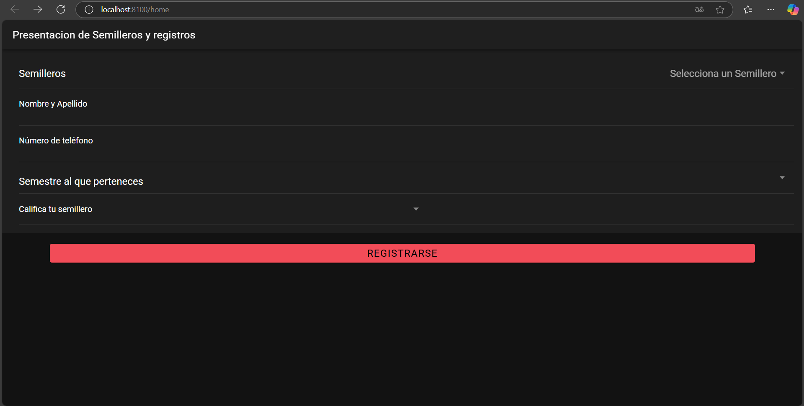

[!imagen=   ]
<ion-page>

  <!-- ion-page: Página Principal -->
  <ion-header :translucent="true">
    <ion-toolbar>

      <!-- ion-title: Título de la Página -->
      <ion-title>Presentacion de Semilleros y registros</ion-title>
    </ion-toolbar>

  </ion-header>

  <ion-content :fullscreen="true">

    <!-- ion-header: Encabezado Condensado -->

    <ion-header collapse="condense">
      <ion-toolbar>
        <!-- ion-title: Título grande al reducir -->
        <ion-title size="large">Registro</ion-title>
      </ion-toolbar>
    </ion-header>

    <ion-list class="expanded-list">
      <!-- ion-item: Selección de Semillero -->
      <ion-item class="expanded-item">
        <!-- ion-select: Menú de Semilleros -->
        <ion-select
          label="Semilleros"
          placeholder="Selecciona un Semillero"
          color="danger"
          class="expanded-select"
        >
          <!-- ion-select-option: Opción Innovación -->
          <ion-select-option value="Innovacion">Innovacion</ion-select-option>
          <!-- ion-select-option: Opción Inteligencia Artificial -->
          <ion-select-option value="Inteligencia Artificial">Inteligencia Artificial</ion-select-option>
          <!-- ion-select-option: Opción Protección Ambiental -->
          <ion-select-option value="Proteccion Ambiental">Proteccion Ambiental</ion-select-option>
        </ion-select>
      </ion-item>

      <!-- ion-item: Campo de Nombre y Apellido -->
      <ion-item class="expanded-item">
        <!-- ion-label: Etiqueta de Nombre y Apellido -->
        <ion-label position="floating">Nombre y Apellido</ion-label>
        <!-- ion-input: Entrada de texto para Nombre y Apellido -->
        <ion-input type="text" class="expanded-input"></ion-input>
      </ion-item>

      <!-- ion-item: Campo de Número de Teléfono -->
      <ion-item class="expanded-item">
        <!-- ion-label: Etiqueta de Teléfono -->
        <ion-label position="floating">Número de teléfono</ion-label>
        <!-- ion-input: Entrada de Teléfono -->
        <ion-input type="tel" class="expanded-input"></ion-input>
      </ion-item>

      <!-- ion-item: Selección de Semestre -->
      <ion-item class="expanded-item">
        <!-- ion-select: Menú de Semestres -->
        <ion-select
          label="Semestre al que perteneces"
          label-placement="floating"
          class="expanded-select"
        >
          <!-- ion-select-option: Opción 1-3 Semestre -->
          <ion-select-option value="1-3 Semestre">1-3 Semestre</ion-select-option>
          <!-- ion-select-option: Opción 3-7 Semestre -->
          <ion-select-option value="3-7 Semestre">3-7 Semestre</ion-select-option>
          <!-- ion-select-option: Opción 7-10 Semestre -->
          <ion-select-option value="7-10 Semestre">7-10 Semestre</ion-select-option>
        </ion-select>
      </ion-item>

      <!-- ion-item: Calificación del Semillero -->
      <ion-item class="expanded-item">
        <!-- ion-label: Etiqueta de Calificación -->
        <ion-label>Califica tu semillero</ion-label>
        <!-- ion-select: Menú de Calificación -->
        <ion-select class="expanded-select">
          <!-- ion-select-option: Calificación de 1 a 10 -->
          <ion-select-option value="1">1</ion-select-option>
          <ion-select-option value="2">2</ion-select-option>
          <ion-select-option value="3">3</ion-select-option>
          <ion-select-option value="4">4</ion-select-option>
          <ion-select-option value="5">5</ion-select-option>
          <ion-select-option value="6">6</ion-select-option>
          <ion-select-option value="7">7</ion-select-option>
          <ion-select-option value="8">8</ion-select-option>
          <ion-select-option value="9">9</ion-select-option>
          <ion-select-option value="10">10</ion-select-option>
        </ion-select>
      </ion-item>
    </ion-list>

    <!-- Contenedor del Botón de Registro -->
    

      <!-- ion-button: Botón de Registro -->
      <ion-button id="registro-alert" color="danger" expand="block">Registrarse</ion-button>
      <!-- ion-alert: Alerta de Confirmación de Registro -->
      <ion-alert
        trigger="registro-alert"
        message="Gracias por registrarse"
        :buttons="alertButtons"
      ></ion-alert>
    

  </ion-content>
</ion-page>

