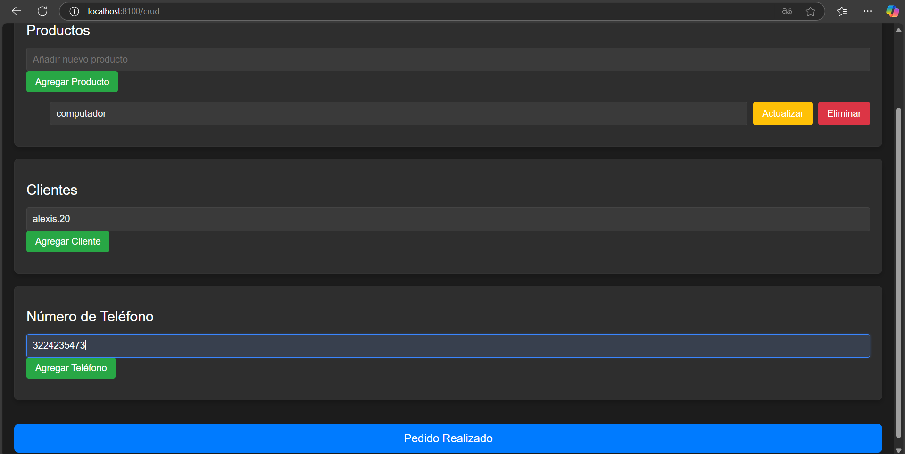

[!Captura de pantalla = ]

<template>
  <!-- Contenedor Principal -->
  

    <!-- Título de la Tienda -->
    <h1>TIENDA ALEXIS</h1>

    <!-- Componente CRUD para Productos -->
    <CrudSection
      title="Productos"
      :items="productos"
      new-item-placeholder="Añadir nuevo producto"
      @add="addProducto"
      @update="updateProducto"
      @delete="deleteProducto"
    />

    <!-- Componente CRUD para Clientes -->
    <CrudSection
      title="Clientes"
      :items="clientes"
      new-item-placeholder="Añadir nuevo cliente"
      @add="addCliente"
      @update="updateCliente"
      @delete="deleteCliente"
    />

    <!-- Componente CRUD para Número de Teléfono -->
    <CrudSection
      title="Número de Teléfono"
      :items="telefonos"
      new-item-placeholder="Añadir nuevo número de teléfono"
      @add="addTelefono"
      @update="updateTelefono"
      @delete="deleteTelefono"
    />

    <!-- Botón de Finalizar Pedido -->
    <button @click="finalizeOrder" class="btn-finalize">Pedido Realizado</button>
  

</template>

